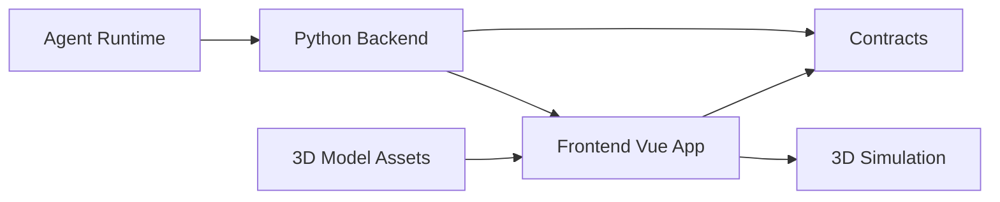

# 架构约定草案

最后更新：2026-05-25

## 1. 当前阶段边界

本阶段目标是复刻功能、沉淀契约、准备 3D 演示和 Agent 展示能力。暂不接入真实硬件。

系统可先按以下边界拆分：

## 2. 前端职责

- 展示水厂总览、设备状态、告警、流程图和操作入口。
- 展示 Agent 运行过程，包括消息、工具调用、结果和错误。
- 加载 3D 模型，用动画表达设备操作和流程变化。
- 通过 `contracts/` 对齐后端字段，不私自发明跨端字段。

## 3. 后端职责

- 提供设备、工艺、告警、Agent 流程等 API。
- 聚合数据和 mock 数据。
- 后续接入 Agent 编排与工具调用。
- 后续若接入真实硬件，必须增加安全隔离和权限控制。

## 4. 3D 模拟职责

- 接收前端状态或事件。
- 将设备状态映射成动画、颜色、材质、流向或提示。
- 只表达演示效果，不作为真实控制反馈。

## 5. Agent 展示职责

Agent 展示层先关注可解释性：

- 用户目标。
- Agent 计划。
- 工具调用。
- 参数摘要。
- 执行状态。
- 结果或错误。
- 对应设备或 3D 动画事件。

## 6. 契约优先

以下内容必须先进入 `contracts/`：

- 新增接口。
- 新增设备状态字段。
- 新增 Agent 事件类型。
- 新增 3D 动画事件类型。
- 前后端都依赖的枚举。

契约可以是草案，但不能只停留在聊天记录里。
