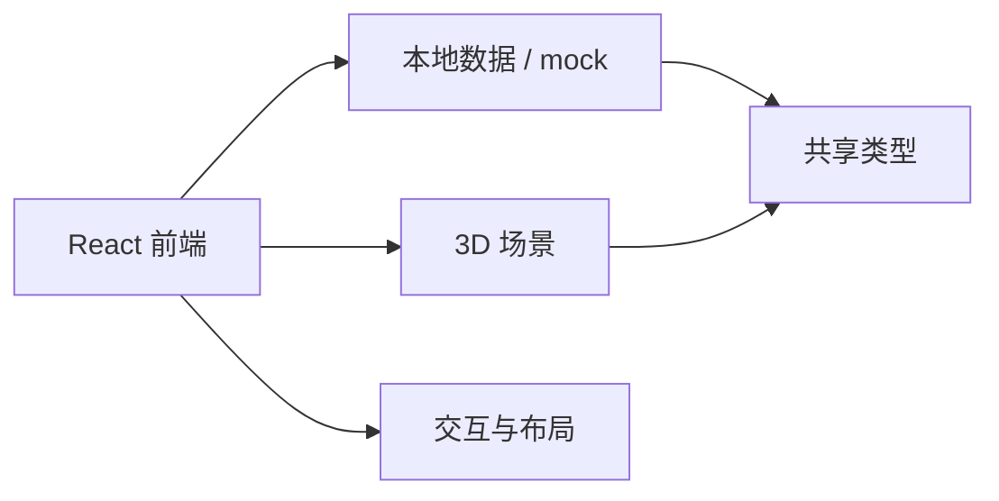

# 架构草案
最后更新：2026-05-26

## 1. 当前阶段

当前阶段只做前端：

- React 版 Demo 继续演进
- 3D 展示、Agent 展示、参数控制、时间轴演示继续保留
- 真实后端暂缓
- 接口层先保留契约和 mock 入口

## 2. 当前边界

## 3. 分层建议

- `app/`：应用装配和全局壳
- `pages/`：页面组合层
- `features/`：按业务域拆分的功能模块
- `components/`：通用组件
- `simulation3d/`：3D 场景和设备表现
- `api/`：mock、适配器、未来真实接口入口
- `data/`：初始数据、场景脚本、静态配置
- `types/`：共享类型定义

## 4. 当前重点

1. 把 `App.tsx` 中的状态和业务动作拆分出去。
2. 把 3D 场景逻辑从 UI 容器里剥离。
3. 把参数控制、演练时间轴、Agent 卡片拆成独立功能块。
4. 把 mock 数据和领域类型集中起来，避免散落在组件里。

## 5. 暂缓事项

- 后端服务实现
- 真接口联调
- 鉴权和权限体系
- 生产级数据持久化

## 6. 目标状态

最终前端应满足：

- 页面只做组合
- 功能模块可单独交付
- 3D 场景可以独立维护
- 接口替换不需要改大范围 UI
- 新同学能按目录快速定位责任边界
